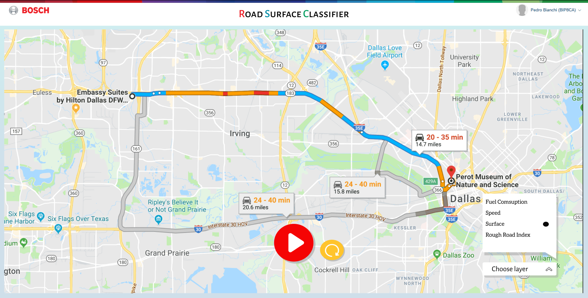

# Road Surface Classifier Front-End MVP

Welcome to our MVP Repo! Here will be all the development of the Front-End for this prototype.

## Prototype



## How To Run

```git
    git clone [repo-url]
```

Inside project root folder

```npm
    npm install
```

After npm have installed dependencies

```angular
    ng serve
```

## Build With

* [Angular.js](https://v6.angular.io/docs) - 6.0.8
* [TypeScript](https://www.typescriptlang.org/docs/handbook/release-notes/typescript-2-7.html) -2.7.2
* [Google Maps API](https://cloud.google.com/maps-platform/maps/)
* [Google Routes API](https://cloud.google.com/maps-platform/routes/)
